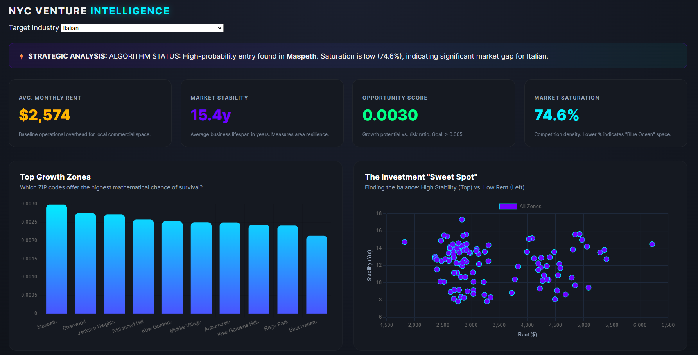
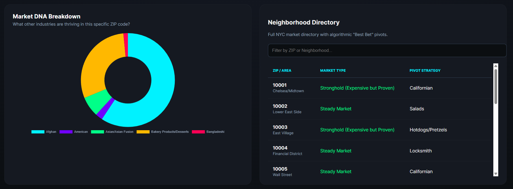

# 🗽 NYC Venture Intelligence Dashboard

## 📊 Overview

This Business Intelligence (BI) dashboard provides a data-driven analysis of the New York City commercial landscape. It moves beyond raw numbers to provide **Strategic Insights**, helping entrepreneurs identify "Gold Mine" neighborhoods where business stability is high and overhead (rent) is low.

---

## 💡 Key Features

- **Proprietary Opportunity Score:** An algorithmic ranking system that balances **Business Longevity** vs. **Market Saturation** and **Rental Costs**.
- **Interactive Analytics Suite:**
  - **Top Growth Zones:** Vertical bar chart ranking the top 10 ZIP codes.
  - **Investment "Sweet Spot":** A 2D scatter plot identifying high-stability, low-cost outliers.
  - **Market DNA:** A breakdown of the competitive landscape within specific ZIP codes.
- **Dynamic Pro-Tip Generator:** Contextual summaries that translate data into actionable business advice.
- **Real-Time Directory Search:** Instantly filter 200+ NYC neighborhoods by ZIP or name.

---

## ⚙️ Data Engineering Process (Python)

Before the dashboard could render, I performed an extensive ETL (Extract, Transform, Load) process on the raw NYC Open Data:

1.  **Data Ingestion:** Processed large-scale CSV/API exports from the NYC Department of Small Business Services.
2.  **Cleaning & Preprocessing:** - Filtered out inactive business licenses and outlier "Ghost" ZIP codes.
    - Standardized business categories using string manipulation and Regex.
    - Handled null values in "Average Rent" columns using median imputation to maintain data integrity.
3.  **Feature Engineering:** - Calculated **Neighborhood Stability** by aggregating business "Duration" (Current Date - Start Date).
    - Developed a **Saturation Index** by calculating the frequency of business types per square mile.
4.  **Export:** Converted processed DataFrames into optimized, minified JSON structures for seamless frontend integration.

## 🛠️ Technical Architecture & Pipeline

This project demonstrates a full-cycle data pipeline, from raw data ingestion to interactive visualization.

- **Data Engineering (Python):** - **Pandas & NumPy:** For data cleaning, handling missing values, and type conversion.
  - **Geopandas:** (Optional, if used) for spatial joining of ZIP codes and borough boundaries.
  - **Scikit-Learn:** (Optional, if used) for normalizing the Opportunity Score.
- **Frontend:** HTML5, CSS3 (Glassmorphism), Vanilla JavaScript (ES6+).
- **Visualization:** [Chart.js](https://www.chart.js.org/) for high-performance canvas rendering.
- **Deployment:** [Netlify](https://www.netlify.com/) for CI/CD.

---

## 📈 Data Insights & Methodology

The dashboard utilizes a multi-factor calculation to determine the **Opportunity Score**:

$$Opportunity Score = \frac{Stability (Avg Years Active)}{Monthly Rent \times Saturation Factor}$$

- **Rent:** Monthly commercial averages adjusted by ZIP.
- **Stability:** Average years a business in that category remains active in the specific neighborhood.
- **Saturation:** The density of similar business types relative to the city-wide average.

---

## 🚀 How to Use

1. **Explore:** Select an industry from the dropdown (e.g., "Cafe" or "Retail").
2. **Analyze:** Check the **Pro-Tip Banner** for the system's top recommendation.
3. **Drill Down:** Use the **Scatter Plot** to find neighborhoods that offer "High Stability" but aren't yet over-saturated.
4. **Search:** Use the directory to find specific metrics for your local neighborhood.

---

_Developed for the March 2026 NYC Market Analysis Suite._
